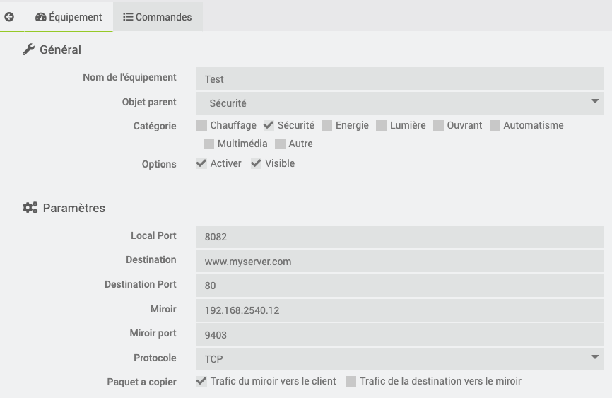
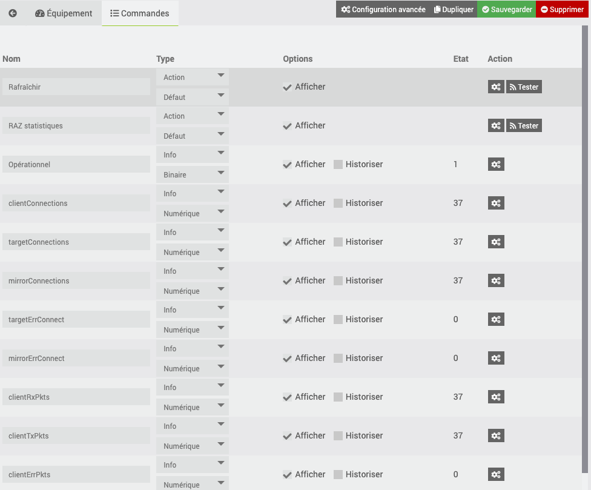

# Description

Ce plugin permet de dupliquer des flux TCP vers un serveur "miroir". Le plugin agit comme un proxy, c'est a dire que les clients vont envoyer leurs requêtes vers le proxy plutôt que vers le serveur destination, et le plugin se chargera de transmettre cette requête au serveur, et au miroir.

Grâce à ce plugin, vous pouvez renvoyer des informations a un serveur de tests, ou comme c'est mon cas, dupliquer les informations pour réaliser le traitement a la fois dans Jeedom, et sur le serveur réel.
En effet, ma centrale d'alarme ne me permet pas d'envoyer les meme informations a deux serveurs différents. Donc, ma centrale envoie les informations a trafficmirror, qui se charge de les transmettre a Jeedom et a la télésurveillance.
Bien sur, il faut dans ce cas de la redondance pour s'assurer que la centrale pourra toujours communiquer avec la télésurveillance si votre plugin trafficmirror est injoignable.

# Installation

Afin d'utiliser le plugin, vous devez le télécharger, l'installer et l'activer comme tout plugin Jeedom.

Une fois le plugin activé, vous devez installer les dépendances. En effet, le plugin repose sur un demon (python) pour prendre en charges les requêtes TCP.

Ne modifiez pas le port par default d’écoute du demon, il s'agit du port de communication entre le demon et Jeedom. Si toutefois ce port est déjà utilise, alors vous pouvez en sélectionner un nouveau.

N'oubliez pas d'activer la gestion automatique du demon, particulièrement si vous utilisez ce plugin pour des taches critiques.

# Configuration de l'équipement

Le plugin se trouve dans le menu Plugins > Communication.
Après avoir créé un nouvel équipement, vous devez impérativement remplir les différentes sections de configuration du plugin.

La configuration est simple.

- Local port : le port TCP sur lequel l’équipement va écouter les requêtes clientes.
- destination IP ou FQDN et port : cela représente les informations du serveur. Sans ce plugin, ceux sont les informations que vous auriez configure sur le client.
- miroir IP ou FQDN et port : cela représente les informations du miroir.
- protocole: TCP
- paquet a copier : permet de choisir les informations qui seront transmises au miroir. Par défaut, les informations reçues du client sont envoyées au miroir ("*Trafic envoyé par le client*" est sélectionné), mais les informations reçu du serveur destination ne sont pas renvoyé au miroir ("*trafic reçu de la destination*" n'est pas sélectionné).

Une fois sauvegarde, l’équipement est automatiquement ajoute dans le demon, et est prêt a recevoir des requêtes.

# Surveillance des équipements

En plus de la surveillance du demon par Jeedom si l'option "Activation de la surveillance" du demon est activée, le plugin collecte des informations toutes les 5 minutes sur l'ensemble des équipements actifs.

Dans ces commandes, on retrouve des compteurs de connections (client, miroir et destination), des compteurs de transmission de paquets, des compteurs d'erreurs, le status de l’équipement (s'il est en mesure ou pas de recevoir des requêtes).

Il est également possible de mettre a jour les compteurs, et de rafraîchir l’équipement a la demande.

# Limitations connues

- je n'ai pas fait de tests de performance, et donc je ne suis pas en mesure le nombre de connection par secondes, ni le nombre de paquets qui peuvent être transmit par trafficmirror.

# Désinstallation du plugin

Si vous changer d'avis, et que vous souhaitez d'installer le plugin, il suffit simplement de le supprimer dans la page de configuration.

# En cas de difficulté

Si malgré cette documentation et après voir lu les sujets en rapport avec le plugin sur [community]({{site.forum}}) vous ne trouvez pas de réponse à votre question, n'hésitez pas à créer un nouveau sujet en n'oubliant pas de mettre le tag du plugin ({{site.tagPlugin}}).
